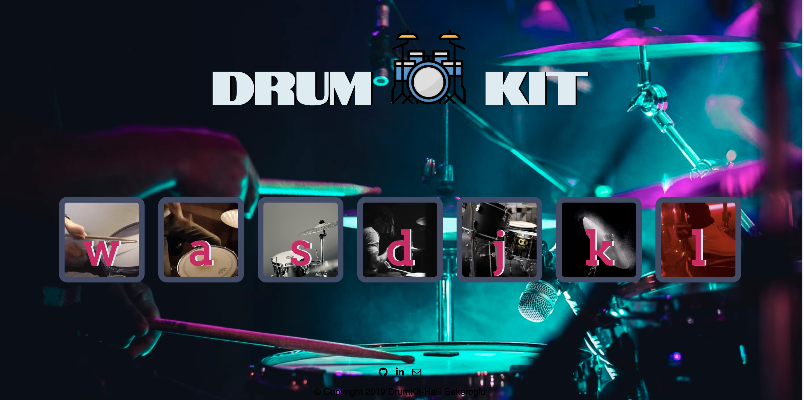

# Drum-Kit


*A quite simple Drum-Kit built by manipulating document structure,style and content based on Document Object Model.*  

---
## Technologies Used
-  HTML5 
-  CSS3
-  JavaScript 


you can visit website on [here](https://drum-kit-play.herokuapp.com/
"drum-kit-play") 

```javascript 
for (var i = 0; i < document.querySelectorAll('.drum').length; i++) {
    document.querySelectorAll('.drum')[i].addEventListener("click", function () {
        makeSound(this.innerHTML);
        makeAnimation(this.innerHTML);
    });


| Name| Email |
|---------|-------|
|Halil Sekeroglu |  halil.sekerogluu@gmail.com |


